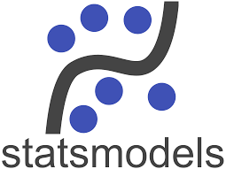
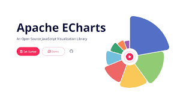
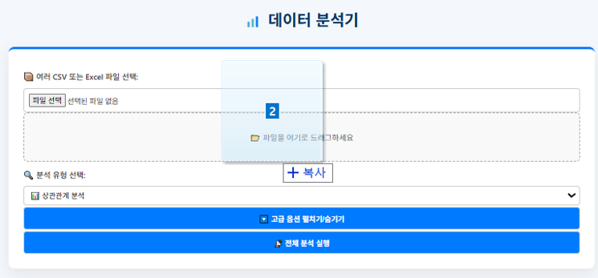
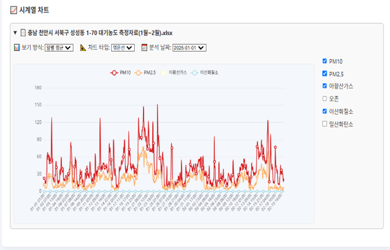

<div align="center">

<!-- logo -->

<div align="center">
  <h1>📊 데이터 분석기 (Summer Hackathon)</h1>
  <p>Python 기반 Flask 서버와 HTML/CSS/JS 프론트엔드로 구현된 파일 기반 자동 데이터 분석 웹 애플리케이션</p>

  []()
  []()
  <br>
  
  
  
  
  
</div>

</div>
CSV/Excel 파일 기반 시계열 및 상관관계 분석 자동화 도구. 시각화 + 요약 기능을 포함한 웹 기반 서비스입니다.

---

## 📝 소개

개인 해커톤 프로젝트로, 다양한 CSV/XLSX 데이터를 업로드하여
시계열 분석, 상관관계 분석, 시각화를 한 번에 처리하고 결과를 저장/조회하는 전자 서비스입니다.

> ⚠️ 데모 버전으로 일부 파일 형식/분석 기능에 제약이 있습니다.

---

## 🔍 주요 기능

| 기능 영역        | 설명                            |
| ------------ | ----------------------------- |
| 📂 다중 파일 업로드 | 여러 CSV/Excel 동시 업로드 지원        |
| 📈 시계열 분석    | 날짜 기반 그래프 (Line, Area, Bar)   |
| 🔗 상관관계 분석   | Pearson, ANOVA, Cramér's V    |
| 🧩 시각화 기능    | Scatter, Bubble, Pie, Radar 등 |
| 💾 결과 저장     | 분석 결과 `.jsonl` 저장 및 불러오기      |
| 🤖 GPT 요약    | 선택적으로 분석 결과 요약 지원 (옵션)        |

---

## 💡 기술 스택


### Backend

<div>



</div>

### Frontend

<div>



</div>

### Tools

<div>


</div>

---

## 📁 프로젝트 구조

```
📦 analyzer
 ┣ 📂 utils                # 분석 로직 (correlation, timeseries, stats)
 ┣ 📂 routes               # Flask routing 처리
 ┣ 📂 static/frontend      # 정적 파일 (CSS/JS/아이콘)
 ┣ 📂 templates            # Jinja HTML 템플릿
 ┣ 📂 uploads              # 업로드된 원본 파일 보관
 ┣ 📜 app.py               # Flask 진입점
 ┗ 📜 requirement.txt      # 종속성 패키지 목록
```

---

## 🎬 화면 구성

|                                                         Upload + 분석 옵션                                                         |                                                            차트 결과 시각화                                                           |
| :----------------------------------------------------------------------------------------------------------------------------: | :----------------------------------------------------------------------------------------------------------------------------: |
|  |  |

---

## 🛠 향후 개선 계획

* Excel 자동 헤더 인식 및 날짜 필터링 강화
* 분석 결과 저장 및 복원 기능 개선 (DB 연동 예정)
* 전체 분석 알고리즘 속도 향상 및 병렬처리 적용
* 오류 메시지 및 예외 처리 로직 세분화

---
* 데이터 업로드\~시각화 전체 기능 직접 설계 및 개발 (100%)
* 추후 GPT 요약 기능 및 분석 결과 공유 기능 예정
